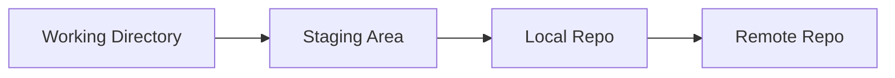
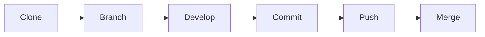
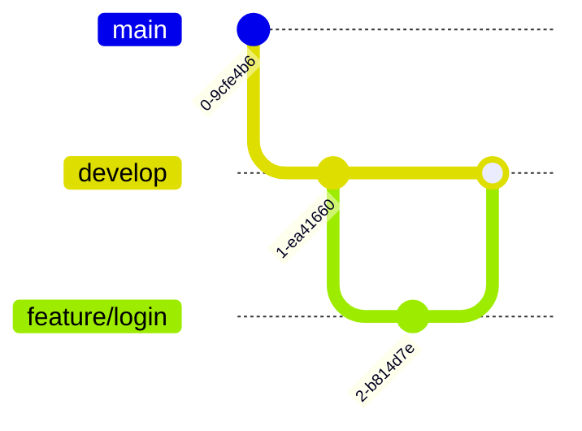

# 🚀 Git Training Guide (Ultimate Edition - Full CLI + GitKraken)

## 📘 คู่มือการใช้งาน Git สำหรับเจ้าหน้าที่ (ฉบับสมบูรณ์ระดับอบรม)

---

# 🌟 ทำไมต้องใช้ Git?

Git คือ Version Control System ที่ช่วย:

- 🧾 เก็บประวัติ
- 👥 ทำงานเป็นทีม
- ⏪ rollback ได้
- 🌿 แยก branch

---

# 🧠 Concept Git



---

# 💻 Git CLI (ละเอียด 🔥)

## 🔧 Setup ครั้งแรก

```bash
git config --global user.name "Your Name"
git config --global user.email "your@email.com"
git config --list
```

---

## 📁 เริ่มต้น Project

```bash
git init
```

---

## 🔍 ตรวจสอบสถานะ

```bash
git status
```

อธิบาย:

- Untracked = ยังไม่ add
- Modified = แก้ไขแล้ว
- Staged = พร้อม commit

---

## ➕ Add

```bash
git add .
git add file.txt
```

---

## 📌 Commit

```bash
git commit -m "เพิ่มระบบ login"
```

Best Practice:

- feat:
- fix:
- docs:

---

## 📜 ดู History

```bash
git log
git log --oneline
```

---

## 🔄 Undo

### ยกเลิก add

```bash
git restore --staged file.txt
```

### ยกเลิกแก้ไฟล์

```bash
git restore file.txt
```

### ย้อน commit

```bash
git reset --soft HEAD~1
git reset --hard HEAD~1
```

---

## 🌿 Branch

```bash
git branch
git branch feature/login
git checkout feature/login
git checkout -b feature/api
```

---

## 🔀 Merge

```bash
git checkout main
git merge feature/login
```

---

## 🔗 Remote

```bash
git remote add origin <url>
git remote -v
```

---

## 🚀 Push

```bash
git push origin main
```

---

## 🔄 Pull

```bash
git pull origin main
```

---

## 📥 Clone

```bash
git clone <url>
```

---

## ⚠️ Conflict

เกิดเมื่อ:

- แก้ไฟล์เดียวกัน

แก้:

- เปิดไฟล์
- เลือก code
- commit ใหม่

---

# 🖥️ GitKraken (พร้อมภาพตัวอย่าง)

## 📌 GitKraken คืออะไร

GUI Git ที่ช่วยให้:

- เห็น graph
- ลด error

---

## 🔁 Workflow



---

## 🌿 Branch Strategy



---

# 📋 Best Practice

- commit บ่อย
- ใช้ branch
- pull ก่อน
- ห้าม commit .env

---

# 🎯 สรุป

CLI = ต้องรู้  
GitKraken = ใช้ง่าย

---

✨ End
