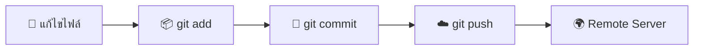
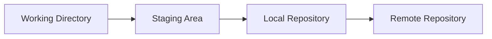
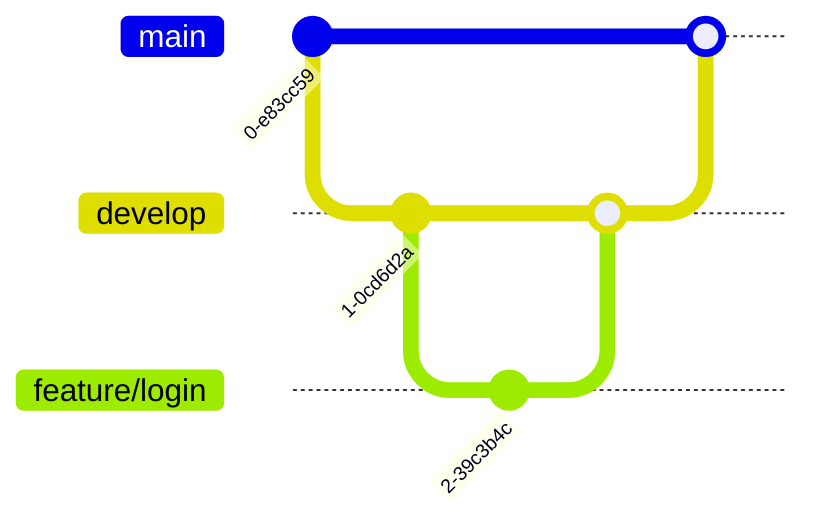

# 🚀 Git Training Guide (Ultimate Edition)
## 📘 คู่มือการใช้งาน Git สำหรับเจ้าหน้าที่ (ฉบับสอนจริง + ใช้งานจริง)

---

# 🌟 ทำไมต้องใช้ Git?

Git คือเครื่องมือที่ช่วยให้:
- 🧾 เก็บประวัติการแก้ไขงาน
- 👥 ทำงานร่วมกันเป็นทีม
- ⏪ ย้อนกลับเวอร์ชันได้
- 🌿 แยกการพัฒนาเป็นส่วน ๆ (Branch)

---

# 🧠 Concept สำคัญ (เข้าใจตรงนี้ = ใช้ Git เป็น)

## 🔁 วงจรการทำงานของ Git



---

# 🧱 โครงสร้าง Git



| ส่วน | อธิบาย |
|------|--------|
| 📝 Working Directory | ไฟล์ที่กำลังแก้ |
| 📦 Staging Area | ไฟล์ที่เตรียม commit |
| 📌 Repository | เก็บประวัติ |

---

# ⚙️ การติดตั้ง

## 💻 Windows
👉 https://git-scm.com

## ✅ ตรวจสอบ
```bash
git --version
```

---

# 🔧 ตั้งค่าเริ่มต้น (สำคัญมาก ❗)

```bash
git config --global user.name "Your Name"
git config --global user.email "your@email.com"
```

---

# 💻 การใช้งาน CLI (พื้นฐาน)

## 🔹 เริ่มต้น
```bash
git init
```

## 🔹 ตรวจสอบสถานะ
```bash
git status
```

## 🔹 เพิ่มไฟล์
```bash
git add .
```

## 🔹 commit
```bash
git commit -m "เพิ่มระบบ login"
```

## 🔹 push
```bash
git push origin main
```

---

# 🌿 การใช้ Branch (หัวใจของ Git)

## 🎯 ทำไมต้องใช้?
- แยกงาน
- ลดการชนกันของโค้ด
- ทำงานพร้อมกันได้

## 🔧 คำสั่ง

```bash
git checkout -b feature/login
git checkout main
git merge feature/login
```

---

# 🖥️ GitKraken (แนะนำ ⭐⭐⭐⭐⭐)

## 📌 จุดเด่น
- ใช้ง่ายมาก
- เห็นภาพ branch ชัด
- ลด error

---

## 🔁 Workflow ใน GitKraken

1. Clone repo
2. สร้าง branch
3. แก้ไขไฟล์
4. Stage + Commit
5. Push
6. Merge

---

# 🔄 Workflow มาตรฐานองค์กร



---

# ⚠️ ปัญหาที่พบบ่อย

## ❌ push ไม่ได้
👉 ต้อง pull ก่อน

## ❌ conflict
👉 แก้ไฟล์ → commit ใหม่

## ❌ undo commit
```bash
git reset --soft HEAD~1
```

---

# 📋 Best Practice (สำคัญมาก 🔥)

- ✅ commit สั้น กระชับ
- ✅ ใช้ branch เสมอ
- ✅ pull ก่อนทำงาน
- ❌ ห้าม commit `.env`
- ❌ ห้ามแก้ main ตรง ๆ

---

# 🧪 Workshop (ใช้สอนจริง)

## 🧪 Lab 1 (Basic)
- init repo
- commit
- push

## 🧪 Lab 2 (Branch)
- สร้าง branch
- merge

## 🧪 Lab 3 (Conflict)
- สร้าง conflict
- แก้ไข

---

# 🎯 สรุป

💡 Git = เครื่องมือสำคัญของนักพัฒนา  
💡 GitKraken = ตัวช่วยให้ใช้ง่ายขึ้น  
💡 ต้องฝึกใช้จริงถึงจะเข้าใจ

---

# 🏁 จบการอบรม

✨ ขอให้สนุกกับ Git 🚀
