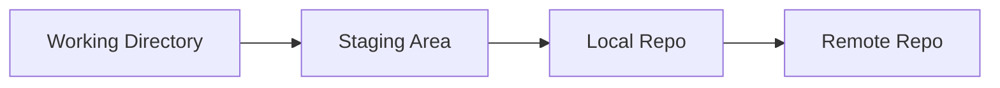
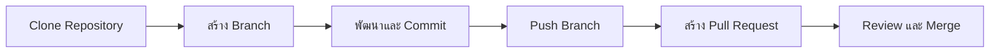
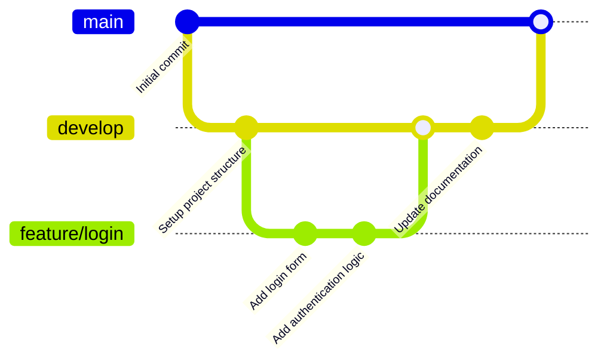

# 🚀 Git Training Guide (Ultimate Edition - Full CLI + GitKraken)

## 📘 คู่มือการใช้งาน Git สำหรับเจ้าหน้าที่ (ฉบับสมบูรณ์ระดับอบรม)

---

# 🌟 ทำไมต้องใช้ Git?

Git คือ Version Control System ที่ช่วย:

- 🧾 เก็บประวัติ
- 👥 ทำงานเป็นทีม
- ⏪ rollback ได้
- 🌿 แยก branch

---

# 🧠 Concept Git



---

# � การติดตั้ง Git และ TortoiseGit บน Windows 11 Pro

## 🪟 การติดตั้ง Git

Git สำหรับ Windows สามารถติดตั้งได้ง่ายๆ ด้วย installer อย่างเป็นทางการ

### ขั้นตอน:

1. **ดาวน์โหลด Git Installer**:
   - ไปที่เว็บไซต์: [https://git-scm.com/download/win](https://git-scm.com/download/win)
   - คลิกดาวน์โหลด Git for Windows (ไฟล์ .exe)

2. **รัน Installer**:
   - ดับเบิลคลิกไฟล์ที่ดาวน์โหลดมา
   - คลิก "Next" เพื่อเริ่ม

3. **เลือก Components**:
   - เลือก "Git Bash Here" และ "Git GUI Here" (แนะนำ)
   - คลิก "Next"

4. **เลือก Default Editor**:
   - เลือก editor ที่ต้องการ เช่น Visual Studio Code หรือ Notepad++
   - ถ้าไม่มี ให้เลือก Vim หรือ Nano
   - คลิก "Next"

5. **ปรับแต่ง PATH**:
   - เลือก "Git from the command line and also from 3rd-party software" (แนะนำ)
   - คลิก "Next"

6. **เลือก HTTPS Transport**:
   - เลือก "Use the OpenSSL library" (default)
   - คลิก "Next"

7. **ปรับแต่ง Line Endings**:
   - เลือก "Checkout as-is, commit as-is" (สำหรับ Windows)
   - คลิก "Next"

8. **เลือก Terminal Emulator**:
   - เลือก "Use MinTTY" (default)
   - คลิก "Next"

9. **ตัวเลือกเพิ่มเติม**:
   - เลือก "Enable file system caching" และ "Enable Git Credential Manager"
   - คลิก "Next"

10. **ติดตั้ง**:
    - คลิก "Install"
    - รอจนเสร็จ

11. **เสร็จสิ้น**:
    - คลิก "Finish"

หลังติดตั้ง คุณสามารถเปิด Command Prompt หรือ PowerShell และพิมพ์ `git --version` เพื่อตรวจสอบ

---

## 🐢 การติดตั้ง TortoiseGit

TortoiseGit เป็น Git client ที่รวมเข้ากับ Windows Explorer ช่วยจัดการ Git ผ่านเมนูคลิกขวา ทำให้ง่ายต่อการใช้งานสำหรับผู้ที่ไม่ถนัด CLI

### ขั้นตอน:

1. **ตรวจสอบ Git**:
   - ต้องติดตั้ง Git ก่อน ถ้ายังไม่มีให้ติดตั้งตามขั้นตอนด้านบน

2. **ดาวน์โหลด TortoiseGit**:
   - ไปที่เว็บไซต์: [https://tortoisegit.org/download/](https://tortoisegit.org/download/)
   - เลือกเวอร์ชันที่เหมาะสม (32-bit หรือ 64-bit ตามระบบ)

3. **รัน Installer**:
   - ดับเบิลคลิกไฟล์ .msi
   - คลิก "Next"

4. **ยอมรับ License**:
   - อ่านและคลิก "I accept the terms in the License Agreement"
   - คลิก "Next"

5. **เลือก Components**:
   - เลือก default หรือปรับตามต้องการ
   - คลิก "Next"

6. **เลือกตำแหน่งติดตั้ง**:
   - ใช้ default หรือเลือกโฟลเดอร์อื่น
   - คลิก "Next"

7. **ติดตั้ง**:
   - คลิก "Install"
   - รอจนเสร็จ

8. **เสร็จสิ้น**:
   - คลิก "Finish"

หลังติดตั้ง:

- คลิกขวาที่โฟลเดอร์ใน Windows Explorer จะเห็นเมนู TortoiseGit
- ฟีเจอร์หลัก: Git Clone, Commit, Push, Pull, Merge, etc. ผ่าน GUI

**เคล็ดลับ**: TortoiseGit ทำงานร่วมกับ Git CLI ได้ดี คุณสามารถใช้ทั้งสองร่วมกัน

---

## 🔧 Setup ครั้งแรก

ก่อนใช้งาน Git คุณต้องตั้งค่าข้อมูลส่วนตัวของคุณก่อน เพื่อให้ Git รู้ว่าคุณคือใครเมื่อทำการ commit

```bash
# ตั้งชื่อผู้ใช้
git config --global user.name "ชื่อของคุณ"

# ตั้งอีเมล
git config --global user.email "your@email.com"

# ตรวจสอบการตั้งค่า
git config --list
```

**คำอธิบาย:**

- `user.name`: ชื่อที่แสดงในประวัติ commit
- `user.email`: อีเมลที่เชื่อมโยงกับ commit
- `--global`: ตั้งค่าให้ใช้กับทุก repository ในเครื่องนี้

---

## 📁 เริ่มต้น Project

เมื่อต้องการเริ่มใช้งาน Git ในโปรเจกต์ใหม่หรือโฟลเดอร์ที่มีอยู่

```bash
# สร้าง repository ใหม่ในโฟลเดอร์ปัจจุบัน
git init
```

**คำอธิบาย:**

- คำสั่งนี้จะสร้างโฟลเดอร์ `.git` ซึ่งเป็นที่เก็บข้อมูล Git ของโปรเจกต์
- หลังจากนี้ คุณสามารถเริ่ม add และ commit ไฟล์ได้

---

## 🔍 ตรวจสอบสถานะ

ใช้คำสั่งนี้เพื่อดูสถานะของไฟล์ใน working directory

```bash
git status
```

**คำอธิบาย:**

- แสดงไฟล์ที่เปลี่ยนแปลง, เพิ่มใหม่, หรือพร้อม commit
- สถานะไฟล์:
  - **Untracked**: ไฟล์ใหม่ที่ Git ยังไม่ติดตาม
  - **Modified**: ไฟล์ที่มีการแก้ไขหลังจาก commit ล่าสุด
  - **Staged**: ไฟล์ที่พร้อม commit (หลังจาก git add)

---

## ➕ Add

เพิ่มไฟล์เข้า staging area ก่อน commit

```bash
# เพิ่มไฟล์ทั้งหมดที่เปลี่ยนแปลง
git add .

# เพิ่มไฟล์เฉพาะ
git add file.txt

# เพิ่มหลายไฟล์
git add file1.txt file2.txt
```

**คำอธิบาย:**

- `git add .`: เพิ่มไฟล์ทั้งหมดในโฟลเดอร์ปัจจุบันและ subfolders
- `git add <file>`: เพิ่มไฟล์เฉพาะ
- หลังจาก add แล้ว ไฟล์จะอยู่ในสถานะ "staged" และพร้อม commit

---

## 📌 Commit

บันทึกการเปลี่ยนแปลงเข้า repository

```bash
# Commit ด้วยข้อความ
git commit -m "เพิ่มระบบ login"

# Commit และแก้ไขข้อความใน editor
git commit

# Commit ไฟล์เฉพาะ
git commit file.txt -m "แก้ไข bug"
```

**Best Practice สำหรับข้อความ commit:**

- ใช้ภาษาอังกฤษหรือภาษาที่ทีมใช้
- เริ่มด้วยคำกริยา เช่น:
  - `feat:` สำหรับฟีเจอร์ใหม่
  - `fix:` สำหรับแก้ไข bug
  - `docs:` สำหรับเอกสาร
  - `refactor:` สำหรับปรับโครงสร้างโค้ด
- ตัวอย่าง: `feat: add user authentication system`

**คำอธิบาย:**

- `-m`: ระบุข้อความ commit โดยตรง
- ถ้าไม่ใช้ `-m` จะเปิด editor ให้พิมพ์ข้อความยาว

---

## 📜 ดู History

ดูประวัติการ commit

```bash
# ดูประวัติแบบละเอียด
git log

# ดูแบบสรุป (หนึ่งบรรทัดต่อ commit)
git log --oneline

# ดูประวัติของไฟล์เฉพาะ
git log -- file.txt

# ดูการเปลี่ยนแปลงในแต่ละ commit
git log --patch
```

**คำอธิบาย:**

- `git log`: แสดงรายละเอียด commit รวมถึง author, date, และ message
- `--oneline`: แสดง commit hash สั้นและ message
- `--patch`: แสดง diff ของแต่ละ commit

---

## 🔄 Undo และ Reset

### ยกเลิกการ add (unstaged)

```bash
# ยกเลิก add ไฟล์เฉพาะ
git restore --staged file.txt

# ยกเลิก add ไฟล์ทั้งหมด
git restore --staged .
```

### ยกเลิกการแก้ไขไฟล์ (discard changes)

```bash
# คืนไฟล์กลับไปเป็นสถานะหลัง commit ล่าสุด
git restore file.txt
```

### ย้อน commit

```bash
# ย้อน commit แต่เก็บการเปลี่ยนแปลงไว้ใน working directory (--soft)
git reset --soft HEAD~1

# ย้อน commit และ unstaged การเปลี่ยนแปลง (--mixed, default)
git reset HEAD~1

# ย้อน commit และลบการเปลี่ยนแปลงทั้งหมด (--hard)
git reset --hard HEAD~1
```

**คำอธิบาย:**

- `HEAD~1`: ย้อนไป 1 commit จาก commit ล่าสุด
- `--soft`: เก็บการเปลี่ยนแปลงไว้ใน staging area
- `--mixed`: เก็บไว้ใน working directory แต่ unstaged
- `--hard`: ลบการเปลี่ยนแปลงทั้งหมด (ระวัง! ไม่สามารถกู้คืนได้)

---

## 🌿 Branch

จัดการ branch สำหรับการพัฒนาฟีเจอร์แยกกัน

```bash
# ดู branch ทั้งหมด
git branch

# ดู branch รวม remote
git branch -a

# สร้าง branch ใหม่
git branch feature/login

# สลับไป branch อื่น
git checkout feature/login

# สร้างและสลับไป branch ใหม่ในคำสั่งเดียว
git checkout -b feature/api

# ลบ branch
git branch -d feature/old-branch
```

**คำอธิบาย:**

- Branch คือ pointer ไปยัง commit หนึ่งๆ
- `main` หรือ `master`: branch หลัก
- ใช้ branch เพื่อพัฒนาฟีเจอร์ใหม่โดยไม่กระทบ main branch

---

## 🔀 Merge และ Rebase

รวมการเปลี่ยนแปลงจาก branch อื่น

### Merge

```bash
# สลับไป branch หลัก
git checkout main

# รวม branch feature/login เข้า main
git merge feature/login
```

**คำอธิบาย:**

- สร้าง merge commit ที่รวมประวัติของทั้งสอง branch
- ถ้ามี conflict จะต้องแก้ก่อน

### Rebase

```bash
# สลับไป branch ที่ต้องการ rebase
git checkout feature/login

# ย้าย base ของ branch นี้ไปยัง main ล่าสุด
git rebase main
```

**คำอธิบาย:**

- ย้าย commit ของ branch ปัจจุบันไปอยู่บน commit ล่าสุดของ branch เป้าหมาย
- ทำให้ประวัติดูเป็นเส้นตรง ไม่มี merge commit

---

## 🔗 Remote Repository

จัดการ repository ระยะไกล

```bash
# เพิ่ม remote repository
git remote add origin https://github.com/user/repo.git

# ดู remote ทั้งหมด
git remote -v

# ลบ remote
git remote remove origin

# เปลี่ยน URL ของ remote
git remote set-url origin https://github.com/newuser/newrepo.git
```

**คำอธิบาย:**

- `origin`: ชื่อ default ของ remote repository
- ใช้สำหรับ push และ pull โค้ด

---

## 🚀 Push

ส่ง commit ไปยัง remote repository

```bash
# Push branch ปัจจุบันไป origin
git push origin main

# Push branch ใหม่ครั้งแรก
git push -u origin feature/new-feature

# Force push (ระวัง! จะเขียนทับ remote)
git push --force origin main
```

**คำอธิบาย:**

- `-u`: ตั้ง upstream branch ให้ push อัตโนมัติครั้งต่อไป
- `--force`: บังคับ push แม้จะมี conflict (ใช้เฉพาะกรณีจำเป็น)

---

## 🔄 Pull และ Fetch

ดึงการเปลี่ยนแปลงจาก remote

```bash
# Pull และ merge อัตโนมัติ
git pull origin main

# ดึงข้อมูลจาก remote แต่ไม่ merge
git fetch origin

# หลัง fetch แล้ว merge เอง
git merge origin/main
```

**คำอธิบาย:**

- `git pull`: เท่ากับ `git fetch` + `git merge`
- `git fetch`: ดึงข้อมูลใหม่จาก remote แต่ไม่เปลี่ยน working directory

---

## 📥 Clone

โคลน repository จาก remote

```bash
# โคลน repository
git clone https://github.com/user/repo.git

# โคลนไปยังโฟลเดอร์เฉพาะ
git clone https://github.com/user/repo.git my-project
```

**คำอธิบาย:**

- สร้างโฟลเดอร์ใหม่และโคลนทั้ง repository รวมประวัติ

---

## ⚠️ จัดการ Conflict

เมื่อ merge หรือ pull มี conflict

1. Git จะแสดงไฟล์ที่มี conflict
2. เปิดไฟล์และแก้ไข:
   ```
   <<<<<<< HEAD
   code จาก branch ปัจจุบัน
   =======
   code จาก branch ที่ merge
   >>>>>>> feature/branch
   ```
3. เลือก code ที่ต้องการ หรือรวมทั้งสอง
4. Add และ commit ไฟล์ที่แก้แล้ว

```bash
# หลังแก้ conflict แล้ว
git add conflicted-file.txt
git commit -m "Resolve merge conflict"
```

**คำอธิบาย:**

- Conflict เกิดเมื่อสอง branch แก้ไขส่วนเดียวกันของไฟล์
- ต้องแก้ไขด้วยมือก่อน commit

---

## 🔍 ดู Diff

ดูความแตกต่างของไฟล์

```bash
# ดูการเปลี่ยนแปลงที่ยังไม่ staged
git diff

# ดูการเปลี่ยนแปลงที่ staged แล้ว
git diff --staged

# ดู diff ระหว่าง commit
git diff HEAD~1 HEAD

# ดู diff ของไฟล์เฉพาะ
git diff file.txt
```

**คำอธิบาย:**

- แสดงบรรทัดที่เพิ่ม (+) และลบ (-)

---

## 💾 Stash

เก็บการเปลี่ยนแปลงชั่วคราว

```bash
# เก็บการเปลี่ยนแปลง
git stash

# เก็บพร้อมข้อความ
git stash save "working on login"

# ดู stash ที่เก็บไว้
git stash list

# นำกลับมา
git stash pop

# นำกลับมาแต่ไม่ลบ stash
git stash apply

# ลบ stash
git stash drop stash@{0}
```

**คำอธิบาย:**

- ใช้เมื่อต้องการเปลี่ยน branch แต่ยังไม่พร้อม commit
- `pop`: นำกลับและลบ stash
- `apply`: นำกลับแต่เก็บ stash ไว้

---

## 🏷️ Tag

ทำเครื่องหมาย commit สำคัญ

```bash
# สร้าง tag ไลท์เวท
git tag v1.0

# สร้าง tag พร้อม annotation
git tag -a v1.0 -m "Release version 1.0"

# ดู tag
git tag

# Push tag ไป remote
git push origin v1.0

# Push tag ทุกอัน
git push origin --tags
```

**คำอธิบาย:**

- Tag ใช้สำหรับ version release
- Annotated tag มีข้อมูลเพิ่มเติม
- Lightweight tag เป็น pointer ไปยัง commit เฉยๆ

---

## 🔧 .gitignore

ไฟล์ที่บอก Git ไม่ให้ติดตามไฟล์บางประเภท

สร้างไฟล์ `.gitignore` และใส่:

```
# Logs
*.log
node_modules/
.DS_Store
```

**คำอธิบาย:**

- ไฟล์ที่ match pattern จะไม่ถูก tracked โดย Git
- ใช้สำหรับไฟล์ build, dependencies, หรือไฟล์ส่วนตัว

---

## 📊 Git Statistics

ดูสถิติของ repository

```bash
# ดูจำนวน commit ต่อ author
git shortlog -sn

# ดู contribution
git log --author="Your Name" --oneline | wc -l
```

**คำอธิบาย:**

- `shortlog`: สรุป commit ตาม author
- สามารถใช้ tool เพิ่มเติมเช่น `gitstats` หรือ `git-quick-stats`

---

# 🖥️ GitKraken (พร้อมภาพตัวอย่าง)

## 📌 GitKraken คืออะไร

GitKraken Desktop เป็น Git GUI (Graphical User Interface) client ที่ออกแบบมาเพื่อทำให้การจัดการ Git ง่ายขึ้นสำหรับนักพัฒนาทุกระดับ ตั้งแต่มือใหม่จนถึงผู้เชี่ยวชาญ มันแปลงคำสั่ง Git ที่ซับซ้อนให้เป็น interface ภาพที่ intuitve ลดโอกาสเกิดข้อผิดพลาด และเพิ่มประสิทธิภาพในการทำงาน

### ฟีเจอร์หลักของ GitKraken Desktop:

- **Commit Graph**: แสดงประวัติ commit เป็นภาพกราฟที่อ่านง่าย ช่วยให้เห็นการเปลี่ยนแปลง การ merge และ branch ได้ชัดเจน
- **Diff View**: ดูความแตกต่างของไฟล์ก่อนและหลังการเปลี่ยนแปลง รองรับการดูแบบ side-by-side, inline หรือ hunk
- **AI-Powered Features**:
  - Commit Composer: ช่วยจัดระเบียบ commit ให้เป็นเรื่องราวที่สอดคล้องกัน
  - Explain Commits: สรุปการเปลี่ยนแปลงในภาษาธรรมชาติ
  - Auto-Resolve Conflicts: แก้ merge conflict ด้วย AI
- **Launchpad**: จัดการ pull requests และ issues โดยจัดหมวดหมู่ตามสถานะ (เช่น ready to merge, CI failing, merge conflicts)
- **Merge Conflict Resolution**: เครื่องมือแก้ conflict ในตัว พร้อมการตรวจจับ conflict ล่วงหน้า
- **Terminal Integration**: รวม terminal ในตัวสำหรับใช้คำสั่ง Git
- **Multi-Platform**: รองรับ Windows, Mac, และ Linux
- **Integrations**: เชื่อมต่อกับ GitHub, GitLab, Bitbucket, Azure DevOps, Jira และอื่นๆ
- **Self-Hosted Option**: สำหรับองค์กรที่ต้องการ deploy ภายใน firewall

### ประโยชน์:

- ลดเวลาในการเรียนรู้ Git CLI สำหรับผู้เริ่มต้น
- เพิ่มความเร็วในการทำงานสำหรับผู้เชี่ยวชาญ
- ช่วยลดข้อผิดพลาดจากคำสั่งผิด
- รองรับทีมใหญ่ด้วยฟีเจอร์ collaboration

### เวอร์ชันและราคา:

- **ฟรีเวอร์ชัน**: ใช้ได้กับ public repositories และฟีเจอร์พื้นฐาน
- **Pro เวอร์ชัน**: สำหรับ private repositories และฟีเจอร์เต็มรูปแบบ (มี trial)
- **Enterprise**: สำหรับองค์กรใหญ่ พร้อม self-hosted

### ลิงก์ดาวน์โหลด:

ดาวน์โหลด GitKraken Desktop ได้ที่: [https://www.gitkraken.com/download](https://www.gitkraken.com/download)

เลือก platform ที่ต้องการ (Windows, Mac, Linux) และติดตั้งตามขั้นตอน

---

## 📸 ตัวอย่างหน้าจอ GitKraken (เวอร์ชันปัจจุบัน)

### Commit Graph View

แสดงประวัติ commit เป็นกราฟภาพ ช่วยให้เห็นการ merge และ branch ได้ง่าย


### Diff View

ดูความแตกต่างของไฟล์แบบละเอียด รองรับการแก้ไข code โดยตรง


### Launchpad (จัดการ PR และ Issues)

จัดกลุ่ม pull requests และ issues ตามสถานะเพื่อให้ทำงานได้มีประสิทธิภาพ


### Pull Request Status

แสดงสถานะ PR แยกตามหมวดหมู่ เช่น ready to merge หรือมี conflict


### GitHub Pull Request Interface

จัดการ PR โดยตรงจาก GitKraken รวมถึงการ review และส่ง suggestions


### Conflict Detection

เตือนล่วงหน้าเมื่อมีโอกาสเกิด conflict จากการทำงานของเพื่อนร่วมทีม


### Auto-Resolve Conflicts with AI

แก้ merge conflict ด้วย AI ที่แนะนำการแก้ไขพร้อมคำอธิบาย


### Commit Composer with AI

จัดระเบียบ commit ให้เป็นเรื่องราวที่สอดคล้องกันด้วย AI


### Explain Commits with AI

สรุปการเปลี่ยนแปลงของ commit ในภาษาธรรมชาติ


---

## 🔁 Workflow ใน GitKraken



### ขั้นตอนการใช้งานพื้นฐาน:

1. **Clone**: โคลน repository จาก remote
2. **Branch**: สร้าง branch ใหม่สำหรับฟีเจอร์
3. **Develop**: แก้ไขโค้ดและ commit เปลี่ยนแปลง
4. **Push**: ส่ง branch ไป remote
5. **PR**: สร้าง pull request สำหรับ review
6. **Merge**: รวม branch เข้า main หลัง review เสร็จ

---

## 🌿 Branch Strategy ใน GitKraken



### คำอธิบาย Strategy:

- **main**: Branch หลักสำหรับ production
- **develop**: Branch สำหรับการพัฒนา
- **feature/**: Branch สำหรับฟีเจอร์ใหม่
- ใช้ merge หรือ rebase เพื่อรวมการเปลี่ยนแปลง

GitKraken ช่วย visualize strategy นี้ได้ชัดเจน ทำให้การจัดการ branch ง่ายขึ้น

---

# 📋 Best Practice

- commit บ่อย
- ใช้ branch
- pull ก่อน
- ห้าม commit .env

---

# 🎯 สรุป

CLI = ต้องรู้  
GitKraken = ใช้ง่าย

---

✨ End
